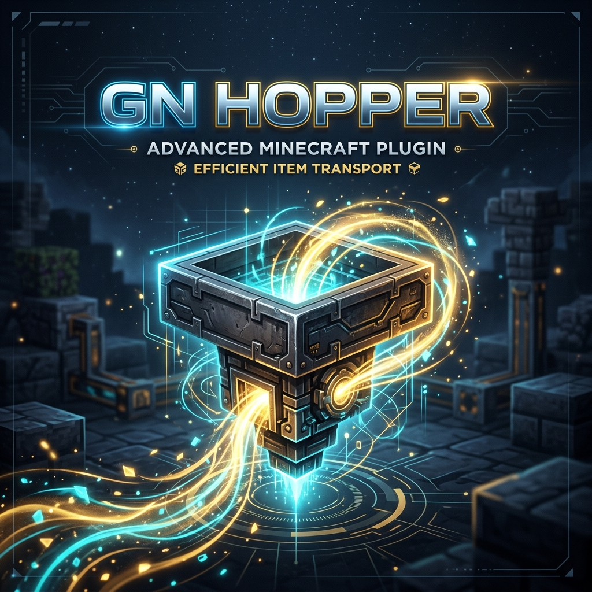

# gnhopper



[](https://opensource.org/licenses/MIT)
[](https://github.com/gn027c/gnhopper)
[](https://www.papermc.io)

**gnhopper** is a premium Minecraft plugin designed for Paper/Purpur servers, providing a powerful, flexible, and highly optimized hopper management system. It aims to solve performance issues while offering professional-grade item filtering.

---

## 🌟 Key Features

- **Optimized Performance:** Features a "Hibernation" system that puts empty hoppers to sleep, significantly reducing CPU usage.
- **Customizable Speed:** Adjustable transfer ticks (from 1 to 20+) and transfer amounts (1 to 64+ items per transfer).
- **Advanced Filtering:** Supports item filtering via Item Frames (on all 6 faces) or an intuitive GUI-based system.
- **Modular Architecture:** Built with a clean, modular structure (`api`, `core`, `paper`) for easy maintenance and extension.
- **Multi-language Support:** Fully supports English and Vietnamese out of the box.
- **Bulletproof System:** Engineered to prevent item loss and resolve conflicts with other protection plugins.

---

## 🚀 Installation

1. Download the latest `.jar` file from the [Releases](https://github.com/gn027c/gnhopper/releases) page.
2. Stop your Minecraft server.
3. Copy the plugin file into your server's `plugins/` directory.
4. Restart the server.
5. Configure the plugin settings in the `plugins/gnhopper/` folder.

---

## 🛠 Building

This project uses Gradle. You can build the plugin locally using the following commands:

```bash
# For Windows
./gradlew.bat shadowJar

# For Linux/macOS
./gradlew shadowJar
```

The compiled JAR file will be located in the `bootstrap/paper/build/libs/` directory.

---

## 📄 License

This project is released under the **MIT** license. See the [LICENSE](LICENSE) file for more details.

---

## 🤝 Contributing

Contributions are always welcome! If you find a bug or have a new feature idea, feel free to open an issue or submit a pull request.

---

*Developed by **gn027c**.*